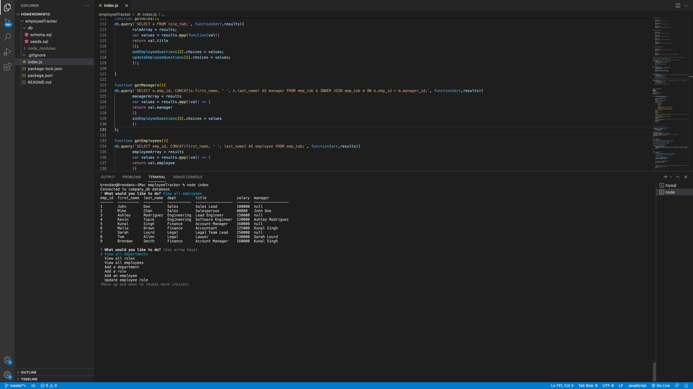

# Employee Tracker (SQL)

[Here is the link to the walkthrough video](https://drive.google.com/file/d/1DLIK_KFHbqhmJf5nZXC-nApW2kfBSLlw/view?usp=sharing)

## Description 

Hello! This is a node project that utilitizes the mysql2, inquirer, and console.table packages. This project was created to complete my week 12 U of MN Web Dev bootcamp assignment. Via the command line, a user can manipulate data in a sql database, thus this serves the purpose of a basic content management system. Schema and Seed SQL files should be run before invoking the application so that the user can have initial data in the database. Thank you!

## Table of Contents

-[Installation](#installation)

-[Usage](#usage)

-[Contributing](#contributing)

-[Tests](#tests)

-[Questions](#questions)

## Installation
To run necessary dependencies, run the following command:

npm i

## Usage

Schema and Seed SQL files should be run before invoking. 

## Contributing

No contributions accepted at this time. 

## Tests

To run tests, run the following command: **npm test**

## Questions

If you have any questions about the repo, or would like to open an issue, please contact me at Brendan838@gmail.com.

Click here to view more of my work on github: [Brendan838](https://github.com/Brendan838). Thank you!